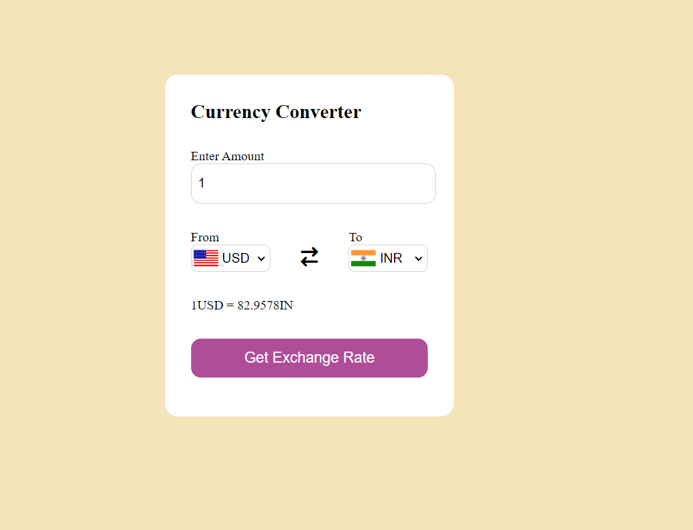

<h1>Currency Converter Project</h1>

<h2>Overview</h2>

This project is a simple yet effective currency converter application built using HTML, CSS, and JavaScript. It utilizes the fetch API to make HTTP requests and integrates two APIs: one for fetching currency conversion rates and another for displaying flags of the selected currencies. The application provides a user-friendly interface, making it easy to convert one currency to another.
Features

   Real-time Currency Conversion: The app fetches the latest conversion rates using a currency converter API. 
   Flag Display: The app displays flags of the selected currencies, providing a visual indication of the source and target currencies. 
   User-friendly Interface: A simple and clean design ensures that users can easily select currencies and input amounts for conversion. 
   Responsive Design: The application is designed to work seamlessly on both desktop and mobile devices. 

<h3>Images</h3>

 

Technologies Used

   HTML: For structuring the content and layout of the application. 
   CSS: For styling the application and creating a visually appealing user interface. 
   JavaScript: For implementing the core functionality of the currency conversion and interacting with the APIs. 
   Fetch API: To perform asynchronous HTTP requests to the currency converter and flag APIs. 
   Currency Converter API: Provides real-time exchange rates for various currencies. 
   Flags API: Provides images of the flags corresponding to the selected currencies. 