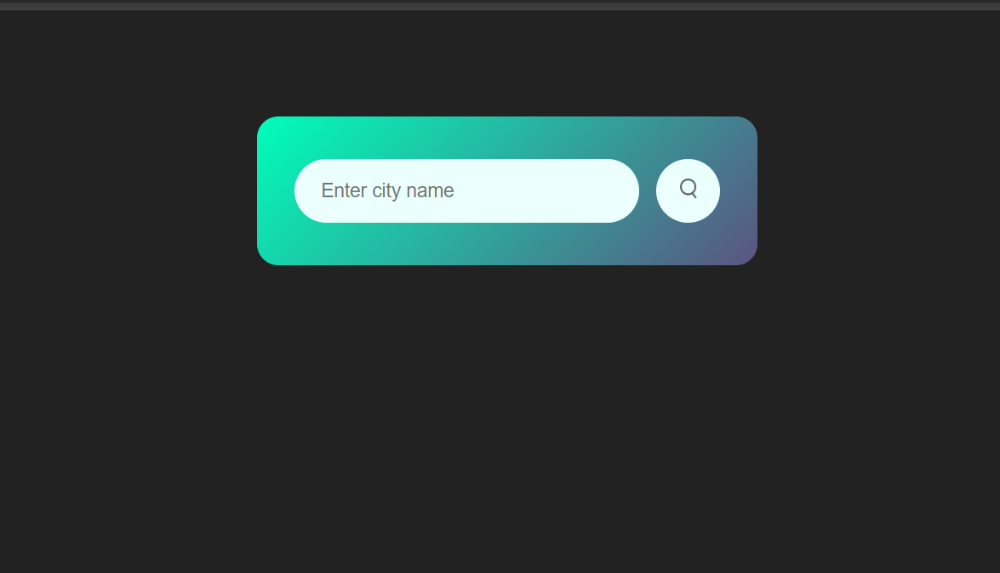
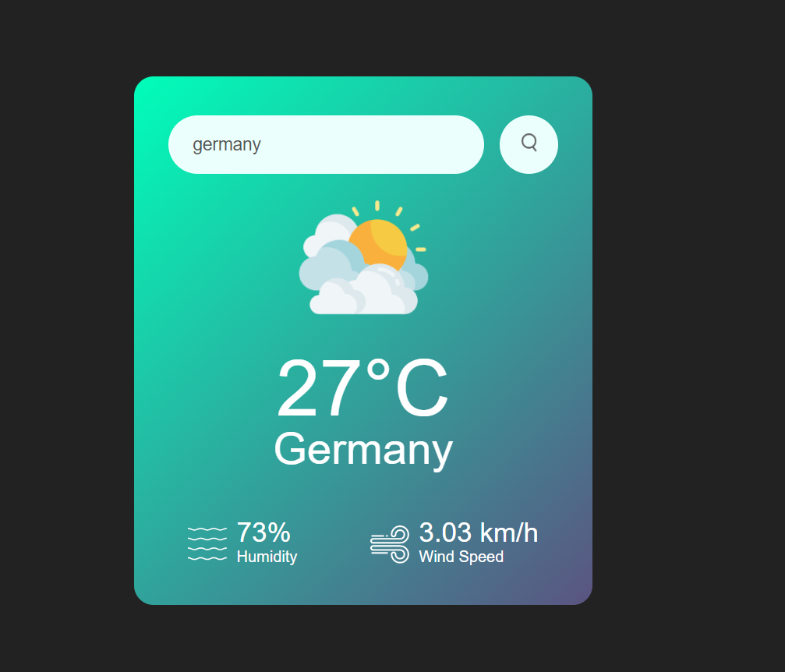

<h1> Weather App 🌦 </h1>

<h2> Overview </h2>

Welcome to the Weather App project! This is a simple yet powerful web application built using HTML, CSS, and JavaScript that allows users to check the current weather conditions of any location around the globe. The app fetches real-time weather data using a Weather API and dynamically updates the UI to display the weather information. Additionally, the app changes the background image to match the weather condition, enhancing the user experience with visual cues.

<h3>Features</h3>

   Real-Time Weather Data: Fetches up-to-date weather information for any location using the Weather API.
   Dynamic Background: Changes the background image based on the current weather condition (e.g., sunny, rainy, cloudy, etc.).
   Responsive Design: The app is fully responsive and works seamlessly on all devices, including desktops, tablets, and smartphones.
   User-Friendly Interface: Intuitive and easy-to-use interface with a clean design.

<h3>Screenshots</h3>

   Below are screenshots showcasing the different background images that correspond to various weather conditions:
   
    
    
   

<h3>Technologies Used</h3>

   HTML5: For structuring the content of the app.
   CSS3: For styling the app, including responsive design and animations.
   JavaScript: For fetching weather data from the API and dynamically updating the UI.
   Weather API: To retrieve real-time weather data for any specified location. 

